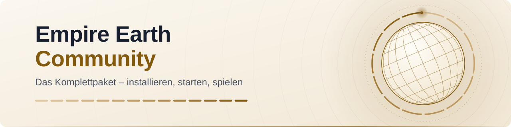
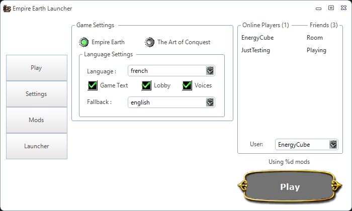

<picture>
  <source media="(prefers-color-scheme: dark)" srcset=".github/assets/banner-dark.svg">
  <source media="(prefers-color-scheme: light)" srcset=".github/assets/banner-light.svg">
  
</picture>

# Empire Earth Community

**Empire Earth, The Art of Conquest und Neo Empire Earth mit einem einzigen Setup installieren – samt Launcher und Mod Creator.**

[](https://github.com/DritteRippe/Empire-Earth-Community/releases/latest)
[](https://github.com/DritteRippe/Empire-Earth-Community/releases)
[](#was-brauchst-du)
[](#quellcode-und-lizenzen)

<p align="center">
  <a href="https://github.com/DritteRippe/Empire-Earth-Community/releases/latest"></a>
  <br>
  <a href="https://github.com/DritteRippe/Empire-Earth-Community/releases/latest"><b>Neueste Version herunterladen</b></a> · <a href="#in-3-schritten-spielen">In 3 Schritten spielen</a> · <a href="#häufige-fragen">Häufige Fragen</a> · <a href="#hilfe-und-feedback">Hilfe</a>
</p>

> [!IMPORTANT]
> **Nur für Besitzer des Originalspiels.** Du brauchst Empire Earth mit der Erweiterung The Art of Conquest (oder die Gold Edition), auf CD mit gültigen Schlüsseln oder digital gekauft. Das Paket enthält die Spieldaten, die Rechte daran liegen bei ihren Inhabern (siehe [Rechtlicher Hinweis](#rechtlicher-hinweis)).

Diese Anleitung erklärt dir Schritt für Schritt, wie du alles mit **einem** Setup installierst.
Du brauchst keine Vorkenntnisse. Lies jeden Schritt und klicke genau das, was dort steht.

| | |
|---|---|
| **Version** | 1.1.1 ([Was ist neu?](#was-ist-neu)) |
| **Status** | freigegeben am 2026-10-09, noch nicht auf einem echten Computer getestet. 1.1.0 ist unter Windows 11 getestet (Update von 1.0.0 und Spielen). Abbrechen ist mit keiner Version auf einem echten Computer getestet, Deinstallieren zuletzt mit 1.0.0 (siehe [Bekannte Probleme](#bekannte-probleme)) |
| **Für** | Windows 10 und Windows 11, nur für Besitzer des Originalspiels |
| **Download** | eine ZIP-Datei, etwa 1,3 GB, auf der [Release-Seite](https://github.com/DritteRippe/Empire-Earth-Community/releases/latest) |

**Das ist enthalten:**

| Teil | Version |
|---|---|
| Empire Earth Community Setup (das eine Setup für alles) | 1.1.1 |
| Empire Earth mit der Erweiterung The Art of Conquest | Setup 1.7.2 (Build `suite-1.1.1-164e561`) |
| Neo Empire Earth (NeoEE) | 2.0.0.5 (Setup 1.7.2, Build `suite-1.1.1-164e561`) |
| Empire Earth Launcher | 1.1.1 |
| Mod Creator | aus Launcher 1.1.1 |
| DirectX-Wrapper dgVoodoo (in den Spielen) | 2.87.5 |

## In 3 Schritten spielen

<a id="schnellstart"></a>

1. **Herunterladen:** Auf der [Release-Seite](https://github.com/DritteRippe/Empire-Earth-Community/releases/latest) unter „Assets“ die Datei **Empire-Earth-Community-1.1.1.zip** laden, nicht „Source code“ ([Schritt 1](#schritt-1-paket-herunterladen)). Ihre Prüfsumme prüfen und die Datei freigeben ([Schritt 2](#schritt-2-download-freigeben-empfohlen)).
2. **Installieren:** Die ZIP-Datei mit „Alle extrahieren“ entpacken, im Ordner „Empire-Earth-Community-1.1.1“ das Programm **„Empire Earth Community Setup“** starten, durch die Seiten klicken, das Originalspiel bestätigen und warten, bis die letzte Seite erscheint ([Schritt 3 bis 9](#schritt-3-zip-entpacken)).
3. **Spielen:** Auf dem Desktop **„Empire Earth Community“** doppelklicken, im Launcher das Spiel wählen und auf „Spielen“ klicken ([Spielen](#spielen)).

- **Zum ersten Mal dabei?** Nimm dir lieber die ausführlichen Schritte unten vor. Sie zeigen dir jedes Fenster genau.
- **Hast du schon Version 1.1.0 oder 1.0.0?** Dann lies zuerst [Update von 1.1.0](#update-von-110) oder [Update von 1.0.0](#update-von-100).
- **Liest du diese Anleitung schon im entpackten Ordner „Empire-Earth-Community-1.1.1“?** Dann hast du den Download hinter dir. Mach mit [Schritt 4](#schritt-4-setup-starten) weiter.

## Inhalt

- [In 3 Schritten spielen](#in-3-schritten-spielen)
- [Was wird installiert?](#was-wird-installiert)
- [Was brauchst du?](#was-brauchst-du)
- [Update von 1.1.0](#update-von-110)
- [Update von 1.0.0](#update-von-100)
- [Schritt 1: Paket herunterladen](#schritt-1-paket-herunterladen)
- [Schritt 2: Download freigeben (empfohlen)](#schritt-2-download-freigeben-empfohlen)
- [Schritt 3: ZIP entpacken](#schritt-3-zip-entpacken)
- [Schritt 4: Setup starten](#schritt-4-setup-starten)
- [Schritt 5: SmartScreen](#schritt-5-smartscreen-nur-wenn-du-schritt-2-übersprungen-hast)
- [Schritt 6: Benutzerkontensteuerung](#schritt-6-benutzerkontensteuerung)
- [Schritt 7: Die Seiten des Setups](#schritt-7-die-seiten-des-setups)
- [Schritt 8: Warten (oder abbrechen)](#schritt-8-warten-oder-abbrechen)
- [Schritt 9: Die letzte Seite](#schritt-9-die-letzte-seite)
- [Wo finde ich alles?](#wo-finde-ich-alles)
- [Spielen](#spielen)
- [Der Launcher](#der-launcher)
- [Bild und Fenster](#bild-und-fenster)
- [Reparieren](#reparieren)
- [Deinstallieren](#deinstallieren)
- [Wenn etwas nicht klappt](#wenn-etwas-nicht-klappt)
- [Protokolle für die Hilfe](#protokolle-für-die-hilfe)
- [Paket prüfen (Prüfsummen)](#paket-prüfen-prüfsummen)
- [Bekannte Probleme](#bekannte-probleme)
- [Häufige Fragen](#häufige-fragen)
- [Was ist neu?](#was-ist-neu)
- [Versionen](#versionen)
- [Hilfe und Feedback](#hilfe-und-feedback)
- [Technische Details](#technische-details)
- [Quellcode und Lizenzen](#quellcode-und-lizenzen)
- [Rechtlicher Hinweis](#rechtlicher-hinweis)

## Was wird installiert?

- **Empire Earth** (mit der Erweiterung The Art of Conquest)
- **Neo Empire Earth** (NeoEE)
- der **Empire Earth Launcher**: Mit ihm startest du alle vier Spiele. Er hat auch Werkzeuge für Einstellungen und Reparatur.
- der **Mod Creator**

Die Intro-Videos der Spiele werden standardmäßig mit installiert.

Du kannst im Setup auch nur eines der beiden Spiele auswählen. Der Launcher wird mit installiert (wenn das .NET Framework 4.8 vorhanden ist).

## Was brauchst du?

- **Das Originalspiel.** Du musst Empire Earth und seine Erweiterung (oder die Gold Edition) auf CD mit gültigen Schlüsseln besitzen oder das Spiel digital gekauft haben. Das Setup fragt dich danach. Ohne das Originalspiel kannst du nicht installieren.
- **Windows 10 oder Windows 11.**
- **Etwa 1,3 GB Download.**
- **Genug freien Platz.** Das Setup braucht auf Laufwerk C: etwa 2,9 GB, wenn du beide Spiele installierst. Dazu kommen die ZIP-Datei und der entpackte Ordner (je etwa 1,3 GB). Plane also gut 5,5 GB freien Platz ein.
- **Eine Internetverbindung** während der Installation. Neo Empire Earth registriert dabei seine CD-Keys online.

## Update von 1.1.0

Hast du Version 1.1.0 installiert? Dann musst du nichts deinstallieren.

1. Lade das neue Paket herunter, prüfe es und entpacke es wie in [Schritt 1 bis 3](#schritt-1-paket-herunterladen).
2. Starte das neue Setup aus dem Ordner „Empire-Earth-Community-1.1.1“ ([Schritt 4](#schritt-4-setup-starten)). Bei den installierten Spielen steht: „Schon installiert. Das Setup aktualisiert oder repariert es.“
3. Klicke dich durch wie bei der Installation.

**Das bleibt:** die Spiele in ihren Ordnern, deine Spielstände und Profile, deine eigenen Mods in `Data\dxm\mods`, die Einstellungen des Launchers und deine Wahl bei den Intro-Videos.

**Das ändert sich:**

- Der Launcher 1.1.0 wird durch den Launcher 1.1.1 ersetzt (was neu ist, steht unter [Was ist neu?](#was-ist-neu)). Das Symbol „Empire Earth Community“ legt das Setup neu an.
- Die Spiele bleiben bei Setup 1.7.2 und dgVoodoo 2.87.5. Wie bei jeder Reparatur ersetzt das Setup aber `dgVoodoo.conf`, setzt `dreXmod.config` auf die Voreinstellung zurück (Mod aus, Lobby-Theme `dxm`) und stellt die empfohlene Größe des Spielfensters ein. Hast du `dgVoodoo.conf` oder `dreXmod.config` selbst geändert, heb dir vorher eine Kopie auf. Eine eigene Größe des Spielfensters wählst du danach im Launcher neu (siehe [Bild und Fenster](#bild-und-fenster)).
- Der Launcher 1.1.0 hat bei einem zweiten Start manchmal eine zusätzliche Protokolldatei angelegt. Ihr Name ist eine lange Folge aus Zahlen und Buchstaben mit „log.txt“ am Ende, und sie liegt neben „log.txt“ in `%LOCALAPPDATA%\Empire Earth Launcher`. Solche Dateien kannst du löschen. Der Launcher 1.1.1 schreibt nur noch in „log.txt“.

So ist das Update gebaut. Auf einem echten Computer ist es mit 1.1.1 noch nicht getestet (siehe [Bekannte Probleme](#bekannte-probleme)).

Danach kannst du den Ordner von 1.1.0 löschen. Behalte den neuen Ordner „Empire-Earth-Community-1.1.1“ für Reparaturen.

## Update von 1.0.0

Hast du noch Version 1.0.0 installiert? Dann musst du auch nichts deinstallieren. Du kannst direkt auf 1.1.1 aktualisieren.

1. Lade das neue Paket herunter und entpacke es wie in [Schritt 1 bis 3](#schritt-1-paket-herunterladen).
2. Starte das neue Setup ([Schritt 4](#schritt-4-setup-starten)). Bei beiden Spielen steht: „Schon installiert. Das Setup aktualisiert oder repariert es.“
3. Klicke dich durch wie bei der Installation.

**Das bleibt:** die Spiele in ihren Ordnern, deine Spielstände und Profile, deine eigenen Mods in `Data\dxm\mods` und die Einstellungen des Launchers.

**Das ändert sich:**

- Die Verknüpfungen „Empire Earth“ und „Neo Empire Earth“ von 1.0.0 verschwinden, ebenso „Empire Earth Launcher“ und die „… Diagnostic“-Einträge im Startmenü. Dafür gibt es **ein** Symbol: „Empire Earth Community“.
- Die Intro-Videos werden einmal nachinstalliert, falls du sie noch nicht hattest.
- Die Spiele bekommen dgVoodoo 2.87.5 mit neuen Fenstereinstellungen. Hast du `dgVoodoo.conf` selbst geändert, wird die Datei ersetzt. Heb dir vorher eine Kopie auf.
- Das Setup schreibt die Größe des Spielfensters neu (siehe [Bild und Fenster](#bild-und-fenster)).
- `dreXmod.config` geht auf die Voreinstellung zurück (Mod aus, Lobby-Theme `dxm`).

Auf einem echten Computer getestet ist das Update von 1.0.0 auf 1.1.0 (am 2026-10-07), das Update von 1.0.0 auf 1.1.1 noch nicht.

Danach kannst du den Ordner von 1.0.0 löschen. Behalte den neuen Ordner „Empire-Earth-Community-1.1.1“.

## Schritt 1: Paket herunterladen

1. Öffne die Release-Seite: <https://github.com/DritteRippe/Empire-Earth-Community/releases/latest>. Ein Konto bei GitHub brauchst du dafür nicht.
2. Die Seite zeigt das neueste Release, zum Beispiel **„Empire Earth Community 1.1.1“**. Es ist mit „Latest“ markiert.
3. Unten im Release steht „Assets“. Klicke dort auf **Empire-Earth-Community-1.1.1.zip** (etwa 1,3 GB).
4. Warte, bis der Download fertig ist. Die ZIP-Datei liegt danach meistens im Ordner „Downloads“.

Auf die Release-Seite kommst du auch von der Seite des Repositorys (<https://github.com/DritteRippe/Empire-Earth-Community>): Klicke dort rechts auf „Releases“.

> [!IMPORTANT]
> Unter „Assets“ stehen auch „Source code (zip)“ und „Source code (tar.gz)“. Die fügt GitHub bei jedem Release von selbst hinzu. Sie enthalten nur diese Anleitung und die anderen Dokumente, **nicht** das Spiel. Nimm sie nicht. Auch der grüne Knopf „Code“ mit „Download ZIP“ lädt nur die Dokumente herunter.

Das Release mit „Latest“ ist immer die neueste Version. Wie du eine ältere Version holst, steht unter [Versionen](#versionen).

## Schritt 2: Download freigeben (empfohlen)

Damit zeigt Windows später keine SmartScreen-Warnung beim Start des Setups. Gib aber nur eine Datei frei, von der du weißt, dass sie genau die aus dem Release ist. Das Setup hat keine digitale Signatur. Prüfe deshalb zuerst die Prüfsumme der ZIP-Datei. Das dauert etwa eine Minute.

**Zuerst prüfen: Ist es genau die ZIP-Datei aus dem Release?**

1. Öffne den Ordner, in dem die ZIP-Datei liegt (meistens „Downloads“).
2. Windows 11: Klicke mit der rechten Maustaste auf eine freie Stelle im Ordner und dann auf „Im Terminal öffnen“.
   Windows 10: Halte die Umschalttaste gedrückt, klicke mit der rechten Maustaste auf eine freie Stelle und dann auf „PowerShell-Fenster hier öffnen“.
   Es muss ein PowerShell-Fenster sein (die Zeile beginnt mit „PS“).
3. Kopiere diese Zeile, füge sie im neuen Fenster mit einem Rechtsklick ein und drücke Enter:

   ```powershell
   (Get-FileHash -Algorithm SHA256 -LiteralPath .\Empire-Earth-Community-1.1.1.zip).Hash
   ```

   Heißt deine Datei anders, zum Beispiel mit „(1)“ am Ende, passe den Namen in der Zeile an.
4. Nach einer Weile erscheint eine lange Folge aus Zahlen und Buchstaben. Vergleiche sie mit der Prüfsumme der ZIP-Datei im Text des Release auf der Release-Seite (unter „SHA-256“). Groß- und Kleinschreibung spielt keine Rolle.

Stimmen beide überein, mach weiter. Stimmen sie nicht überein, gib die Datei nicht frei und starte nichts daraus: Lösche sie und lade sie neu von der Release-Seite herunter.

**Dann freigeben:**

1. Klicke mit der rechten Maustaste auf die ZIP-Datei.
2. Klicke auf „Eigenschaften“.
3. Unten im Reiter „Allgemein“ steht ein Hinweis zur Sicherheit. Setze dort den Haken bei „Zulassen“.
4. Klicke auf „OK“.

Siehst du kein „Zulassen“? Dann ist nichts zu tun. Mach mit Schritt 3 weiter.

## Schritt 3: ZIP entpacken

1. Klicke mit der rechten Maustaste auf die ZIP-Datei.
2. Klicke auf „Alle extrahieren...“. Unter Windows 11 steht der Eintrag direkt im Menü als „Alle extrahieren“.
3. Klicke im neuen Fenster auf „Extrahieren“.
4. Warte, bis alles entpackt ist. Windows öffnet danach den neuen Ordner.

**Wichtig:** Behalte diesen entpackten Ordner. Du brauchst ihn später für Reparaturen. Die ZIP-Datei kannst du danach löschen.

## Schritt 4: Setup starten

1. Öffne den entpackten Ordner. Darin liegt der Ordner „Empire-Earth-Community-1.1.1“. Öffne auch diesen.
2. Doppelklicke auf **„Empire Earth Community Setup“**. Windows zeigt die Endung „.exe“ oft nicht an.

Starte das Setup **nie direkt aus der ZIP-Datei** heraus. Neben dem Setup liegen viele Dateien mit den Namen „Empire Earth Community Setup-1.bin“, „Empire Earth Community Setup-2.bin“ und so weiter. Diese Dateien müssen im selben Ordner neben dem Setup bleiben. Verschiebe oder lösche keine davon.

## Schritt 5: SmartScreen (nur wenn du Schritt 2 übersprungen hast)

Vielleicht erscheint ein blaues Fenster: „Der Computer wurde durch Windows geschützt“.

1. Klicke auf „Weitere Informationen“.
2. Klicke auf „Trotzdem ausführen“.

Das Setup hat keine digitale Signatur. Deshalb warnt Windows hier. Klicke nur dann auf „Trotzdem ausführen“, wenn du das Paket selbst von der Release-Seite geladen hast, am besten mit geprüfter Prüfsumme ([Schritt 2](#schritt-2-download-freigeben-empfohlen)).

## Schritt 6: Benutzerkontensteuerung

Windows fragt: „Möchten Sie zulassen, dass durch diese App Änderungen an Ihrem Gerät vorgenommen werden?“

1. Klicke auf „Ja“.

## Schritt 7: Die Seiten des Setups

**Seite „Was möchtest du installieren?“**

1. Beide Spiele haben schon einen Haken: „Empire Earth (mit The Art of Conquest)“ und „Neo Empire Earth (NeoEE)“. Lass beide Haken stehen, wenn du beide Spiele willst.
2. Unter jedem Spiel steht, ob es „Noch nicht installiert.“ oder „Schon installiert. Das Setup aktualisiert oder repariert es.“ ist.
3. Lass den Haken bei „Erweitert: Das Setup jedes Spiels selbst durchgehen“ **leer**. Die meisten brauchen das nicht.
4. Klicke auf „Weiter“.

**Seite „Lizenz und Hinweise“**

1. Lies die Lizenzvereinbarung (EULA).
2. Darunter steht die Frage: „Haben Sie das Originalspiel und seine Erweiterung (oder Gold Edition) auf CD mit gültigen Schlüsseln oder haben Sie das Spiel digital erworben?“
3. Wenn das stimmt, setze den Haken bei „Ja“.
4. Klicke auf „Weiter“. (Hast du Neo Empire Earth nicht ausgewählt, heißt der Knopf hier „Installieren“.)

Ist eines der Spiele schon installiert, fragt das Setup nicht noch einmal. Dann steht dort: „Du hast schon ein Spiel installiert, deshalb musst du diese Frage nicht noch einmal beantworten.“

**Seite „Regeln für NeoEE“** (nur wenn Neo Empire Earth ausgewählt ist)

1. Lies die Regeln.
2. Klicke auf „Installieren“.

Einen Ordner musst du nicht auswählen. Das Setup wählt ihn selbst.

## Schritt 8: Warten (oder abbrechen)

Jetzt installiert das Setup die Spiele nacheinander. Zuerst Empire Earth, danach Neo Empire Earth. Alles läuft in **einem** Fenster.

- Oben steht, was gerade passiert, zum Beispiel: „Schritt 1 von 2: Empire Earth - lädt Sprachdatei 3 von 17 herunter ...“ oder „Schritt 2 von 2: NeoEE - registriert die CD-Keys ...“.
- Darunter steht die Datei, an der das Setup gerade arbeitet. Der Balken zeigt den ganzen Lauf.
- Die Liste darunter hakt ab, was schon fertig ist, zum Beispiel „Spieldateien installiert“ und „Fertig“.
- Neo Empire Earth registriert dabei seine CD-Keys online. Lass die Internetverbindung an.

Klicke in dieser Zeit nichts an. Warte, bis die letzte Seite erscheint.

**Abbrechen**

So ist das Abbrechen gebaut. Bisher ist es nur in einem automatischen Test geprüft, mit keiner Version auf einem echten Computer (siehe [Bekannte Probleme](#bekannte-probleme)).

Solange ein Spiel noch nicht installiert wird, zum Beispiel während es seine Sprachdateien herunterlädt, kannst du auf „Abbrechen“ klicken. Das Setup fragt dann nach, zum Beispiel: „Möchtest du die Installation von Empire Earth (mit The Art of Conquest) abbrechen?“

- Klickst du „Ja“, wird von diesem Spiel nichts installiert. Ein Spiel, das schon installiert war, bleibt genau so, wie es war.
- Ist das erste Spiel in diesem Lauf schon fertig, bleibt es installiert. Das Setup legt dann noch den Launcher und die Verknüpfung an, ohne das abgebrochene Spiel.
- Was das Setup bis dahin heruntergeladen hat, bleibt in einem temporären Ordner von Windows (ein Ordner „is-*.tmp“, bis zu etwa 170 MB), bis Windows oder du ihn löschst.

Sobald ein Spiel installiert wird, geht das nicht mehr. Der Knopf „Abbrechen“ ist dann grau, und unter dem Balken steht: „Abbrechen ist nicht mehr möglich: Das Spiel wird gerade installiert.“ Ein halb installiertes Spiel soll es nicht geben.

Während ein Spiel installiert wird, wirken die Tasten Esc und Tab im Fenster nicht. Nimm die Maus.

## Schritt 9: Die letzte Seite

Die letzte Seite zeigt unter „Das hat das Setup gemacht:“, was installiert wurde, zum Beispiel:

- „Empire Earth (mit The Art of Conquest): installiert“
- „Sprachdateien: 17 von 17 aus dem Download installiert.“
- „Neo Empire Earth (NeoEE): installiert“
- „Empire Earth Launcher: installiert“
- „NeoEE-CD-Keys: registriert.“

Außerdem steht dort, wo die Protokolle liegen.

1. Lass den Haken bei „Launcher jetzt starten“ gesetzt, wenn du gleich spielen willst.
2. Klicke auf „Fertigstellen“.

Steht oben „Nicht alles wurde installiert“? Dann lies den Abschnitt „Wenn etwas nicht klappt“.

## Wo finde ich alles?

**Auf dem Desktop** liegt eine Verknüpfung: **„Empire Earth Community“**. Sie öffnet den Launcher.

**Im Startmenü** gibt es den Ordner „Empire Earth Community“. Darin findest du:

- „Empire Earth Community“ (der Launcher)
- „Mod Creator“ (nur mit .NET Framework 4.8)
- „Uninstall Empire Earth Community“ (zum Deinstallieren)

## Spielen

1. Doppelklicke auf dem Desktop auf „Empire Earth Community“. Der Launcher öffnet sich.
2. Auf der Seite „Spielen“ wählst du unter „Spiel“ eines der vier Spiele:
   - „Empire Earth“
   - „Empire Earth – The Art of Conquest“
   - „Neo Empire Earth“
   - „Neo Empire Earth – The Art of Conquest“
3. Klicke auf „Spielen“.
4. Lass den Launcher offen, bis das Hauptmenü des Spiels da ist.

Der Launcher merkt sich, welches Spiel du zuletzt gewählt hast. Ein grauer Eintrag ist nicht installiert.

**Die Maus beim Start:** Startest du über den Launcher, gibt er dem Spiel ein paar Sekunden nach dem Start ein Signal. Damit reagiert die Maus sofort, ohne Alt+Tab. Mehr dazu unter [Bekannte Probleme](#bekannte-probleme).

Klicke nicht noch einmal auf „Empire Earth Community“, während ein Spiel läuft. Der Launcher kommt dann nach vorn, und das Spiel minimiert sich.

Fehlt auf deinem Computer das .NET Framework 4.8, gibt es keinen Launcher. Dann startet „Empire Earth Community“ direkt Neo Empire Earth (oder Empire Earth, wenn nur das installiert ist).

## Der Launcher

<p align="center">
  
  <br>
  <sub>Der ursprüngliche Entwurf des Launchers aus dem Ursprungsprojekt <a href="https://github.com/EE-modders/Empire-Earth-Launcher">EE-modders/Empire-Earth-Launcher</a> (GPL-3.0). Der Launcher 1.1.1 in diesem Paket hat mehr Seiten, zum Beispiel „Grafik“ und „Werkzeuge“, und sieht im Detail anders aus.</sub>
</p>

Links im Launcher findest du diese Seiten:

- **Spielen:** die vier Spiele und der Knopf „Spielen“.
- **Einstellungen:** Einstellungen der Spiele und Hinweise.
- **Grafik:** die Größe des Spielfensters (siehe [Bild und Fenster](#bild-und-fenster)). Darunter zeigt die Seite den DirectX-Wrapper und die Werte seiner `dgVoodoo.conf`, nur zur Anzeige.
- **Mods:** die Presets von dreXmod, nur zur Anzeige. Mit „Mods-Ordner öffnen“ und „dreXmod.config öffnen“ kommst du an die Dateien.
- **Werkzeuge:** Prüfungen und Hilfen, zum Beispiel „Reparatur-Hinweise“ und unter „Updates“ den Knopf „Release-Seite öffnen“ (siehe [Versionen](#versionen)).
- **Launcher:** die gefundenen Installationen, die Sprache des Launchers und mehr.

Das Fenster des Launchers kannst du größer ziehen oder maximieren.

## Bild und Fenster

- **Spielfenster:** Das Setup stellt das Spielfenster auf die Größe deines Bildschirms ein, höchstens 1920 × 1200. Ist dein Bildschirm breiter als 1920 Pixel, behält das Fenster seine Form: Ein Bildschirm mit 2560 × 1440 bekommt 1920 × 1080, einer mit 2560 × 1600 bekommt 1920 × 1200.
- **Selbst wählen:** Im Launcher auf der Seite „Grafik“ wählst du unter „Auflösung:“ eine andere Größe und klickst auf „Diese Größe verwenden“. Der Launcher sichert vorher die alten Werte. Eine Reparatur oder ein Update mit dem Setup stellt wieder die empfohlene Größe ein. Wähle dann einfach neu.
- **dgVoodoo 2.87.5:** Die Spiele laufen mit dem DirectX-Wrapper dgVoodoo 2.87.5 und neuen Fenstereinstellungen. Damit funktionieren auf dem Test-Laptop die Mehrspieler-Lobby, der Szenario-Editor und Alt+Tab. Der Szenario-Editor zeigt ein 4:3-Bild mit Rändern links und rechts. Das ist so gewollt.
- **Den Wrapper wechseln:** Das macht nur das Setup. Starte es erneut, setze den Haken bei „Erweitert: Das Setup jedes Spiels selbst durchgehen“ und wähle im Setup des Spiels „Benutzerdefinierte Installationseinstellungen“ und dann unter „DirectX-Wrapper“ den Wrapper. So steht es auch im Launcher auf der Seite „Grafik“. So ist es vorgesehen; auf einem echten Computer ist dieser Weg noch nicht getestet (siehe [Bekannte Probleme](#bekannte-probleme)).
- **dgVoodoo.conf selbst ändern:** Jeder Lauf des Setups ersetzt die Datei. Heb dir eine Kopie deiner Fassung auf.

## Reparieren

Ein Spiel startet nicht mehr richtig? Oder die Verknüpfung fehlt?

1. Öffne den entpackten Ordner, den du in Schritt 3 behalten hast, und darin den Ordner „Empire-Earth-Community-1.1.1“.
2. Doppelklicke wieder auf „Empire Earth Community Setup“.
3. Bei den installierten Spielen steht jetzt: „Schon installiert. Das Setup aktualisiert oder repariert es.“
4. Klicke dich wie bei der Installation durch.

Das Setup legt dabei auch die Verknüpfung neu an. Brichst du eine Reparatur ab, solange die Sprachdateien laden, soll das Spiel genau so bleiben, wie es war. Das hat bisher nur der automatische Test geprüft (siehe [Bekannte Probleme](#bekannte-probleme)).

Der Launcher hilft dir dabei: Auf der Seite „Werkzeuge“ zeigt „Reparatur-Hinweise“ die Schritte, und „Setup-Ordner öffnen“ öffnet den entpackten Ordner. Fehlt der Ordner, nennen die „Reparatur-Hinweise“ die Release-Seite dieses Pakets („Downloadseite öffnen“).

Hast du den Ordner nicht mehr? Dann lade das Paket neu von der Release-Seite herunter (<https://github.com/DritteRippe/Empire-Earth-Community/releases/latest>) und entpacke es wie oben beschrieben.

> [!WARNING]
> **Nimm zum Reparieren nie das Setup von empireearth.eu.** Das Setup dort gehört nicht zu diesem Paket. Es trägt dieselbe Versionsnummer 1.7.2, ersetzt aber deine Installation durch seine eigene Fassung und macht dabei Verbesserungen dieses Pakets rückgängig, zum Beispiel dgVoodoo 2.87.5 mit den neuen Fenstereinstellungen. Nimm immer das Setup aus diesem Paket. Seit dem Launcher 1.1.1 nennen die „Reparatur-Hinweise“ für eine Installation aus diesem Paket deshalb nur noch die Release-Seite dieses Pakets. Der Launcher 1.1.0 nannte dort noch die Downloadseite von empireearth.eu.

## Deinstallieren

So ist das Deinstallieren gebaut. Auf einem echten Computer lief es mit „Behalten“ und mit „Löschen“ zuletzt mit 1.0.0, mit 1.1.0 und 1.1.1 nicht. Mit 1.1.1 hat es bisher nur ein automatischer Test geprüft, jetzt auch mit „Löschen“ (siehe [Bekannte Probleme](#bekannte-probleme)).

1. Schließe alle Spiele und den Launcher.
2. Öffne „Einstellungen“ > „Apps“ > „Installierte Apps“. Unter Windows 10 heißt die Seite „Apps & Features“.
3. Suche den Eintrag **„Empire Earth Community (Launcher, EE, NeoEE)“**. In der Liste stehen auch die Spiele einzeln (Einträge, die mit „Empire Earth“ und „NeoEE“ beginnen). Um alles zu entfernen, wähle nur „Empire Earth Community (Launcher, EE, NeoEE)“.
4. Windows 11: Klicke rechts daneben auf „...“ und dann auf „Deinstallieren“. Windows 10: Klicke auf den Eintrag und dann auf „Deinstallieren“.
5. Bestätige mit „Deinstallieren“ und bei der Benutzerkontensteuerung mit „Ja“.
6. Das Setup zeigt eine Liste: „Dabei wird entfernt:“. Darunter steht: „Deine Spielstände, Profile, eigenen Mods und Launcher-Sicherungen bleiben erhalten, außer du entscheidest am Ende anders.“ Klicke auf „Ja“. Danach fragt das Setup noch: „Sind Sie sicher, dass Sie Empire Earth Community und alle zugehörigen Komponenten entfernen möchten?“ Klicke auch dort auf „Ja“. Bei beiden Fragen ist „Nein“ vorausgewählt: Klicke mit der Maus, drück nicht einfach Enter.
7. Die Spiele werden nacheinander entfernt. Oben steht zum Beispiel „Schritt 1 von 2: Neo Empire Earth (NeoEE) wird entfernt ... (das kann mehrere Minuten dauern)“.
8. Am Ende kommt vielleicht die Frage „Spielstände, Profile, eigene Mods und Sicherungen auch löschen?“
   - Klicke auf „Behalten (empfohlen)“, wenn du deine Spielstände behalten willst.
   - Klicke nur auf „Löschen“, wenn sie wirklich weg sollen. Das lässt sich nicht rückgängig machen.

Hinweis: Die Einstellungen und das Protokoll des Launchers werden immer gelöscht.

Entfernst du nur ein Spiel über seinen eigenen Eintrag in „Apps“, bleibt „Empire Earth Community“ da. Im Launcher steht das Spiel dann grau. Willst du es zurück, starte das Setup aus dem entpackten Ordner erneut (siehe „Reparieren“).

## Wenn etwas nicht klappt

Bei allen Meldungen in diesem Abschnitt, die mit „Es wurde nichts installiert.“ enden, wurde wirklich nichts verändert. Du kannst das Problem beheben und das Setup einfach neu starten.

<details>
<summary>Meldung: „Das Setup wurde direkt aus dem ZIP-Archiv (oder aus einem temporären Ordner) gestartet ...“</summary>

Du hast das Setup in der ZIP-Datei angeklickt. Entpacke zuerst die ZIP-Datei mit „Alle extrahieren...“ (Schritt 3). Starte das Setup dann aus dem neuen Ordner.

</details>

<details>
<summary>Meldung: „Das Paket ist unvollständig oder beschädigt. Diese Dateien neben dem Setup fehlen oder haben eine falsche Größe: ...“</summary>

Eine oder mehrere .bin-Dateien fehlen oder sind kaputt. Die Meldung nennt die Dateien.

1. Prüfe, ob alle .bin-Dateien neben dem Setup liegen.
2. Prüfe, ob dein Virenschutz eine Datei in die Quarantäne verschoben hat (siehe unten).
3. Hilft das nicht: Lade das Paket neu herunter und entpacke die ganze ZIP-Datei in einen neuen Ordner.

</details>

<details>
<summary>Meldung: „Das Setup-Programm von ... in diesem Paket ist beschädigt“ oder „... konnte nicht entpackt werden“</summary>

Das Paket ist beschädigt. Lade es neu herunter und entpacke die ganze ZIP-Datei.

</details>

<details>
<summary>Meldung: „Empire Earth, The Art of Conquest, NeoEE oder der Empire Earth Launcher läuft.“</summary>

Ein Spiel oder der Launcher ist noch offen. Beende das Programm. Schau auch unten rechts in der Taskleiste nach. Starte das Setup dann erneut.

</details>

<details>
<summary>Meldung: „Auf dem Laufwerk C: ist nicht genug Platz frei: Das Setup braucht dort etwa ... frei sind nur ...“</summary>

Lösche auf diesem Laufwerk nicht mehr benötigte Dateien. Leere den Papierkorb. Starte das Setup dann erneut. Du kannst auch nur ein Spiel auswählen, dann braucht das Setup weniger Platz.

</details>

<details>
<summary>Frage: „Das Setup von ... hat seit 10 Minuten keinen Fortschritt gezeigt. ...“</summary>

Vielleicht ist die Internetverbindung sehr langsam. Klicke auf „Ja“, um weiter zu warten. „Nein“ beendet das Setup dieses Spiels.

</details>

<details>
<summary>Auf der letzten Seite steht „Sprachdateien: ... von ... aus dem Download installiert. Für die übrigen ... verwendet das Spiel die Dateien des Setups ...“</summary>

Einige Sprachdateien kamen nicht an. Das Spiel läuft trotzdem, aber manche Inhalte sind vielleicht nicht übersetzt. Starte das Setup später mit funktionierender Internetverbindung erneut.

</details>

<details>
<summary>Dein Virenschutz meldet etwas oder löscht eine Datei</summary>

Manche Virenschutzprogramme halten unbekannte Programme ohne Signatur für verdächtig. Sie verschieben dann eine Datei in die Quarantäne. Danach fehlt sie, und das Setup meldet ein unvollständiges Paket. Stelle die Datei im Virenschutz wieder her. Entpacke im Zweifel die ZIP-Datei noch einmal.

</details>

<details>
<summary>Windows blockiert das Setup ganz („Smart App Control“ / „Intelligente App-Steuerung“)</summary>

Unter Windows 11 gibt es die „Intelligente App-Steuerung“. Sie blockiert Programme ohne digitale Signatur. Dieses Setup hat keine Signatur. Wenn die Intelligente App-Steuerung eingeschaltet ist, startet das Setup deshalb nicht. Es gibt keinen Trick, das zu umgehen. Es hilft nur, die Intelligente App-Steuerung auszuschalten (in „Windows-Sicherheit“ > „App- & Browsersteuerung“). Achtung: Je nach Windows-Version lässt sie sich danach nicht einfach wieder einschalten. Entscheide selbst, ob du das möchtest.

</details>

<details>
<summary>Der Launcher fehlt (.NET Framework 4.8 fehlt)</summary>

Auf älteren Windows-Versionen fehlt manchmal das .NET Framework 4.8. Das Setup zeigt dann: „Der Empire Earth Launcher braucht das .NET Framework 4.8, das auf diesem Computer fehlt. Ohne es werden nur die Spiele installiert, und die Verknüpfung „Empire Earth Community“ startet Neo Empire Earth (oder Empire Earth, wenn nur das installiert ist) direkt.“

Die Spiele werden trotzdem installiert. Willst du den Launcher und den Mod Creator haben: Installiere das .NET Framework 4.8 von Microsoft. Starte danach das Setup aus dem entpackten Ordner erneut.

</details>

<details>
<summary>Auf der letzten Seite steht „NeoEE-CD-Keys: nicht registriert“ oder „Ergebnis unbekannt“</summary>

Prüfe deine Internetverbindung. Starte dann das Setup erneut, um die Registrierung zu reparieren.

</details>

<details>
<summary>Auf der letzten Seite steht bei einem Spiel „fehlgeschlagen (das Protokoll nennt den Grund)“</summary>

Starte das Setup erneut. Klappt es wieder nicht, melde den Fehler mit den Protokollen (siehe [Protokolle für die Hilfe](#protokolle-für-die-hilfe) und [Hilfe und Feedback](#hilfe-und-feedback)).

</details>

<details>
<summary>Auf der letzten Seite steht bei einem Spiel „von dir abgebrochen, nichts daran wurde geändert“</summary>

Du hast dieses Spiel abgebrochen. Starte das Setup erneut, wenn du es installieren oder reparieren willst.

</details>

## Protokolle für die Hilfe

Wenn du Hilfe brauchst, schicke diese Dateien mit:

1. **Das Protokoll des Setups.** Es liegt im Ordner für temporäre Dateien. Drücke die Windows-Taste und R, tippe `%TEMP%` ein und drücke Enter. Suche die neueste Datei, deren Name mit „Setup Log“ beginnt und mit „.txt“ endet.
2. **Die Protokolle der beiden Spiel-Setups.** Sie liegen im Ordner „Logs“ im Installationsordner, normalerweise „C:\Program Files\Empire Earth Community\Logs“. Die Dateien heißen zum Beispiel „EE-Datum-Uhrzeit.log“ und „NeoEE-Datum-Uhrzeit.log“. Den genauen Ordner zeigt dir auch die letzte Seite des Setups unter „Protokolle:“.
3. **Das Protokoll des Launchers**, wenn es ums Spielen geht. Drücke die Windows-Taste und R, tippe `%LOCALAPPDATA%\Empire Earth Launcher` ein und drücke Enter. Die Datei heißt „log.txt“. Wichtig sind die Zeilen ab „Game started:“ des Spielstarts, um den es geht.

Die Deinstallation löscht die Protokolle der Spiel-Setups und des Launchers. Kopiere sie vorher, wenn du sie brauchst.

## Paket prüfen (Prüfsummen)

Die wichtigste Prüfung machst du schon vor dem Freigeben der ZIP-Datei: ihre Prüfsumme (siehe [Schritt 2](#schritt-2-download-freigeben-empfohlen)).

Die Prüfung der entpackten Dateien hier ist freiwillig. Das Setup prüft beim Start selbst, ob alle Dateien da sind und die richtige Größe haben. Willst du ganz sicher sein, dass beim Herunterladen oder Entpacken kein einziges Byte kaputtgegangen ist, kannst du die Prüfsummen vergleichen.

<details>
<summary>So prüfst du die entpackten Dateien</summary>

In der Datei **SHA256SUMS.txt** steht für das Setup und für jede der 26 .bin-Dateien eine lange Folge aus Zahlen und Buchstaben, die Prüfsumme. Ist auch nur ein Byte einer Datei anders, kommt eine ganz andere Prüfsumme heraus.

**So prüfst du alle Dateien auf einmal:**

1. Öffne den entpackten Ordner, in dem „Empire Earth Community Setup“ liegt.
2. Windows 11: Klicke mit der rechten Maustaste auf eine freie Stelle im Ordner und dann auf „Im Terminal öffnen“.
   Windows 10: Halte die Umschalttaste gedrückt, klicke mit der rechten Maustaste auf eine freie Stelle und dann auf „PowerShell-Fenster hier öffnen“.
   Es muss ein PowerShell-Fenster sein (die Zeile beginnt mit „PS“). In der Eingabeaufforderung funktioniert der Text unten nicht.
3. Kopiere diesen Text, füge ihn im neuen Fenster mit einem Rechtsklick ein und drücke Enter:

   ```powershell
   Get-Content .\SHA256SUMS.txt | ForEach-Object {
       $soll, $datei = $_ -split '  ', 2
       $ist = (Get-FileHash -Algorithm SHA256 -LiteralPath $datei).Hash
       if ($ist -eq $soll) { "OK      $datei" } else { "FEHLER  $datei" }
   }
   ```

4. Warte, bis alle Dateien durch sind. Das dauert etwa eine Minute, auf einer langsamen Festplatte länger. Danach steht für jede Datei eine Zeile da.
   - Steht überall **OK**, ist das Paket in Ordnung.
   - Steht irgendwo **FEHLER** oder eine rote Meldung, ist diese Datei beschädigt oder fehlt. Lade das Paket neu herunter und entpacke es in einen neuen Ordner.

**Nur eine einzelne Datei prüfen** geht so:

```powershell
Get-FileHash -Algorithm SHA256 -LiteralPath ".\Empire Earth Community Setup.exe"
```

Vergleiche die angezeigte Prüfsumme („Hash“) mit der Zeile für diese Datei in SHA256SUMS.txt. Groß- und Kleinschreibung spielt dabei keine Rolle.

</details>

Die Prüfsumme der ganzen ZIP-Datei Empire-Earth-Community-1.1.1.zip steht im Text des Release „Empire Earth Community 1.1.1“ auf GitHub.

**Was die Prüfsummen zeigen:** SHA256SUMS.txt liegt mit in der ZIP-Datei. Sie zeigt, ob beim Herunterladen oder Entpacken etwas kaputtgegangen ist. Ob das Paket wirklich aus dem Release stammt, zeigt nur der Vergleich mit der Prüfsumme im Text des Release auf GitHub (Schritt 2): Wer die ZIP-Datei verändert, kann auch SHA256SUMS.txt anpassen.

**Woher kommt das Paket?** Die Datei **BUILD-INFO.txt** nennt genau, woraus dieses Paket gebaut wurde: die Stände (Commits) des Quellcodes, die Prüfsummen der beiden Spiel-Setups, des Launchers und des Mod Creators und noch einmal die Prüfsummen der Setup-Dateien (.exe und .bin). Damit lässt sich das Paket eindeutig seinen Quellen zuordnen.

## Bekannte Probleme

Hier steht ehrlich, was noch nicht rund ist und was du tun kannst.

> [!NOTE]
> **So ist 1.1.1 getestet: noch nicht auf einem echten Computer.** Bis zur Freigabe von Setup und Launcher 1.1.1 am 2026-10-08 lief mit 1.1.1 kein Test auf echter Hardware. Das gilt auch für alles, was in 1.1.1 neu ist (siehe [Was ist neu?](#was-ist-neu)).
> Mit 1.1.0 lief am 2026-10-07 auf einem Laptop mit Windows 11 der erste Teil des Tests: das Update von 1.0.0 auf 1.1.0, Spielen und die Seiten des Launchers. Das ging gut, und die Maus reagiert dort sofort nach dem Start, ohne Alt+Tab. Mit 1.1.1 wurde dieser Teil nicht wiederholt.
> Der zweite Teil des Tests lief weder mit 1.1.0 noch mit 1.1.1. **Mit keiner Version auf einem echten Computer getestet** sind deshalb: das Abbrechen während der Installation, das es seit 1.1.0 gibt (auch bei einer Reparatur), die Übernahme eines Spiels, das mit seinem eigenen Setup installiert wurde, das Setup in anderen Sprachen und der Wechsel des Wrappers über „Erweitert“. **Seit 1.0.0 nicht mehr auf einem echten Computer getestet** sind das Deinstallieren mit „Behalten“ und mit „Löschen“ und eine neue Installation, wenn noch nichts installiert ist: Sie liefen am 2026-10-06 mit 1.0.0, mit 1.1.0 und 1.1.1 nicht. Mit 1.1.1 hat Installation, Übernahme, Reparatur, Abbrechen und Deinstallation (jetzt auch mit „Löschen“) bisher nur ein automatischer Test auf einem Windows-Rechner von GitHub geprüft, mit Platzhaltern statt der Spiele.
> Stößt du auf ein Problem, melde es bitte (siehe [Hilfe und Feedback](#hilfe-und-feedback)).

**1. Die Maus reagiert nach dem Spielstart nicht, wenn du ohne Launcher startest.**
Seit 1.1.0 gibt der Launcher dem Spiel ein paar Sekunden nach dem Start ein Aktivierungssignal. Damit reagiert die Maus sofort, ohne Alt+Tab. Auf dem Test-Laptop ist das mit 1.1.0 bestätigt. Lass den Launcher dafür offen, bis das Hauptmenü da ist. Schließt du ihn früher, kommt kein Signal.
Startest du `Empire Earth.exe` oder `EE-AOC.exe` direkt, ohne Launcher, gibt es kein Signal. Läuft das Spiel mit „Als Administrator ausführen“, nimmt es das Signal sehr wahrscheinlich nicht an: Windows lässt ein Programm ohne Administratorrechte, wie den Launcher, nicht auf ein Programm mit Administratorrechten einwirken. Getestet ist das noch nicht.
Abhilfe in diesen Fällen: einmal Alt+Tab hinaus und wieder zurück.

**2. Das Spiel minimiert sich, wenn ein anderes Fenster oder eine Benachrichtigung erscheint.**
Das macht das Spielprogramm selbst. Setup und Launcher können das nicht abschalten.
Mit dgVoodoo 2.87.5 kommt das Spiel auf dem Test-Laptop über Alt+Tab oder seinen Knopf in der Taskleiste in voller Größe zurück.
Vorbeugen: Schließe Programme, die von selbst Fenster öffnen, bevor du spielst, und schalte Benachrichtigungen stumm (Windows 11: „Nicht stören“, Windows 10: „Fokus-Assistent“). Klicke nicht in andere Programme, während das Spiel lädt.

**3. Die Online-Spielerliste von NeoEE im Launcher zeigt „Spieler online (nicht verfügbar)“.**
Das liegt nicht an deinem Computer. Der Statusserver titan.empireearth.eu war zuletzt im Internet nicht mehr zu finden (er hatte keinen DNS-Eintrag mehr). Das Problem liegt auf der Seite des Servers. Du musst nichts tun.

**4. Der Szenario-Editor zeigt ein 4:3-Bild mit Rändern links und rechts.**
Das ist so gewollt und kein Fehler.

**5. Nach einem Abbruch bleibt ein temporärer Ordner „is-*.tmp“ mit bis zu etwa 170 MB.**
Darin liegt, was das Setup bis zum Abbruch heruntergeladen hat. Windows räumt ihn mit der Speicheroptimierung auf, oder du löschst ihn selbst im Ordner `%TEMP%`.

**6. Auf 32-Bit-Windows fehlt das Programm `dgVoodooCpl.exe`.**
Das Einstellprogramm von dgVoodoo 2.87.5 gibt es nur für 64-Bit-Windows. Die Spiele brauchen es nicht.

## Häufige Fragen

<details>
<summary>Brauche ich ein Konto bei GitHub?</summary>

Zum Herunterladen nicht. Ein kostenloses Konto brauchst du nur, wenn du einen Fehler melden oder dich von GitHub über neue Versionen benachrichtigen lassen willst (siehe [Versionen](#versionen)).

</details>

<details>
<summary>Warum warnt Windows vor dem Setup?</summary>

Das Setup hat keine digitale Signatur. Deshalb zeigt Windows eine SmartScreen-Warnung, und manche Virenschutzprogramme sind misstrauisch. Lade das Paket nur von der Release-Seite und prüfe die Prüfsumme der ZIP-Datei, bevor du sie freigibst ([Schritt 2](#schritt-2-download-freigeben-empfohlen)).

</details>

<details>
<summary>Ist das dasselbe wie die Setups auf empireearth.eu?</summary>

Nein. Die Setups von Empire Earth und NeoEE in diesem Paket sind eigene Builds aus dem Repository [DritteRippe/Empire-Earth-Setup](https://github.com/DritteRippe/Empire-Earth-Setup), unter anderem mit dgVoodoo 2.87.5 und den neuen Fenstereinstellungen. Sie tragen aber dieselbe Versionsnummer 1.7.2 wie die Setups auf empireearth.eu, und Windows kann die beiden nicht auseinanderhalten. Mische sie deshalb nicht: Zum Reparieren und für ein Update nimm immer dieses Paket (siehe [Reparieren](#reparieren)).

</details>

<details>
<summary>Kann ich nur eines der beiden Spiele installieren?</summary>

Ja. Entferne im Setup auf der Seite „Was möchtest du installieren?“ den Haken beim anderen Spiel ([Schritt 7](#schritt-7-die-seiten-des-setups)). Der Launcher wird trotzdem installiert, wenn das .NET Framework 4.8 vorhanden ist.

</details>

<details>
<summary>Wo liegen meine Spielstände?</summary>

In den Spielordnern, in den Unterordnern `Users` und `Data\Saved Games`, eigene Mods in `Data\dxm\mods`. Normalerweise sind das `C:\Program Files (x86)\Empire Earth` und `C:\Program Files (x86)\Neo Empire Earth`. Ein Update von 1.0.0 oder 1.1.0 lässt sie stehen, ebenso das Deinstallieren mit „Behalten“ (siehe [Deinstallieren](#deinstallieren)).

</details>

<details>
<summary>Wie erfahre ich von neuen Versionen?</summary>

Das Paket meldet sich nicht von selbst, und „Nach Updates suchen“ im Launcher prüft dieses Paket nicht. Der Knopf „Release-Seite öffnen“ daneben (Seite „Werkzeuge“) öffnet die Release-Seite. Lass dich von GitHub benachrichtigen oder abonniere den RSS-Feed der Releases (siehe [Versionen](#versionen)).

</details>

## Was ist neu?

Alle Änderungen jeder Version stehen in der Datei [CHANGELOG.md](CHANGELOG.md).

Kurz zu **1.1.1** (2026-10-09), einer Version mit Fehlerbehebungen. Sie ist noch nicht auf einem echten Computer getestet (siehe [Bekannte Probleme](#bekannte-probleme)).

- **Nie mehr zum Setup von empireearth.eu:** Die „Reparatur-Hinweise“ des Launchers nennen für eine Installation aus diesem Paket die Release-Seite dieses Pakets, auch wenn der entpackte Ordner fehlt oder der Launcher ein Update meldet.
- **Launcher, Seite „Werkzeuge“:** der neue Knopf „Release-Seite öffnen“. Die Erklärung zu „Nach Updates suchen“ sagt, dass nur das Spiel und sein Setup geprüft werden, nicht dieses Paket.
- **Launcher:** Ein zweiter Start schreibt in dieselbe Datei „log.txt“, statt eine neue anzulegen. „Nach Updates suchen“, „Version prüfen“ und „Netzwerk prüfen“ enden nicht mehr mit einem unerwarteten Fehler, wenn der Server oder ein Proxy dazwischen einen Zeichensatz nennt, den Windows nicht kennt.
- **Mod Creator:** mehrere Fehler beim Erstellen von Mod-Archiven behoben, zum Beispiel löscht der Export keine eigenen Bilder mehr.
- **Abbrechen und Deinstallieren:** Ein Abbruch genau dann, wenn sich das Setup eines Spiels beendet, wird nicht mehr unnötig wiederholt. „Löschen“ prüft jeden Ordner direkt vor dem Löschen noch einmal auf Verknüpfungen (Junctions), die nach außerhalb der Installation führen könnten.
- **Windows „Apps“:** Die Links für Hilfe und Updates des Eintrags „Empire Earth Community (Launcher, EE, NeoEE)“ führen zu diesem Repository.
- **Anleitung:** neu ist der Abschnitt [Update von 1.1.0](#update-von-110). Dazu kommen ein Formular zum Melden von Fehlern, [SECURITY.md](SECURITY.md) und [CONTRIBUTING.md](CONTRIBUTING.md).

Kurz zu **1.1.0** (2026-10-07):

- **Ein Fenster** für die ganze Installation, mit Statuszeile, Balken und einer Liste der fertigen Schritte. Die Spiel-Setups zeigen keine eigenen Fenster mehr.
- **Abbrechen** geht, bis ein Spiel installiert wird, auch bei einer Reparatur.
- **Ein Symbol** „Empire Earth Community“ statt zwei. Der Launcher zeigt alle vier Spiele in einer Liste und merkt sich deine Wahl.
- **Launcher:** neue Seiten „Grafik“ und „Mods“, ein Fenster, das du größer ziehen kannst, die Seite „Einstellungen“ ohne überlappende Texte, „Reparatur-Hinweise“ mit der Downloadseite der Website.
- **Maus beim Start:** das Aktivierungssignal des Launchers.
- **dgVoodoo 2.87.5** mit neuen Fenstereinstellungen, Spielfenster bis 1920 × 1200.
- **Intro-Videos** werden standardmäßig mit installiert.
- **Download** als eine ZIP-Datei im Release auf GitHub (siehe [Schritt 1](#schritt-1-paket-herunterladen)).

Kurz zu **1.0.0** (2026-10-06): die erste Version. Ein einziges Setup installiert Empire Earth mit The Art of Conquest, Neo Empire Earth, den Empire Earth Launcher und den Mod Creator, repariert sie bei Bedarf und entfernt alles wieder sauber.

## Versionen

Die aktuelle Version steht in der Datei [VERSION](VERSION). Jede Version hat eine Nummer aus drei Teilen, zum Beispiel **1.1.1**:

- Ändert sich die letzte Zahl (1.1.**2**), wurden nur Fehler behoben.
- Ändert sich die mittlere Zahl (1.**2**.0), gibt es neue Funktionen.
- Ändert sich die erste Zahl (**2**.0.0), hat sich etwas Grundlegendes geändert.

So funktioniert es hier:

- **Jede Version ist ein Release** mit einem „v“ vor der Nummer, zum Beispiel **v1.1.1**. Seit 1.1.0 liegt das Paket dort als eine ZIP-Datei unter „Assets“, zum Beispiel Empire-Earth-Community-1.1.1.zip. Was sich geändert hat, steht in [CHANGELOG.md](CHANGELOG.md).
- **Die neueste Version ist immer das Release mit der Markierung „Latest“.** [Schritt 1](#schritt-1-paket-herunterladen) lädt also immer die neueste herunter.
- **Die Hauptseite des Repositorys** zeigt die Anleitung und die anderen Dokumente der neuesten Version. Das Setup und seine .bin-Dateien liegen nur in der ZIP-Datei des Release.
- **Testversionen** sind mit „Pre-release“ markiert, zum Beispiel v1.1.2-rc1. Zum Spielen nimm das Release mit „Latest“.
- **Ältere Versionen bleiben erhalten.** Ein Release wird nachträglich nicht geändert oder gelöscht.

**So erfährst du von neuen Versionen:**

Das Paket meldet sich nicht von selbst, wenn es eine neue Version gibt. So bleibst du auf dem Laufenden:

- **Mit einem GitHub-Konto:** Klicke oben auf der Seite des Repositorys (<https://github.com/DritteRippe/Empire-Earth-Community>) auf „Watch“, dann auf „Custom“, setze den Haken bei „Releases“ und klicke auf „Apply“. GitHub benachrichtigt dich dann bei jeder neuen Version.
- **Ohne Konto:** Trage den RSS-Feed der Releases in einen Feed-Reader ein: <https://github.com/DritteRippe/Empire-Earth-Community/releases.atom>
- Oder schau ab und zu auf die Release-Seite: <https://github.com/DritteRippe/Empire-Earth-Community/releases/latest>

> [!NOTE]
> **Der Launcher sucht nicht nach neuen Versionen dieses Pakets.** Die Knöpfe „Version prüfen“ (Seite „Spielen“) und „Nach Updates suchen“ (Seite „Werkzeuge“) fragen nur den Update-Server von empireearth.eu nach der Version des Spiels und seines Setups (Setup 1.7.2). Nach neuen Versionen von Empire Earth Community fragen sie nicht. Meldet der Launcher „aktuell“, kann es trotzdem eine neue Version dieses Pakets geben. Meldet er eine neuere Version, gilt sie für die Setups von empireearth.eu: Installiere sie nicht über dieses Paket (siehe [Reparieren](#reparieren)). Seit dem Launcher 1.1.1 sagen das auch die Erklärung neben dem Knopf und die „Reparatur-Hinweise“. Der Knopf „Release-Seite öffnen“ neben „Nach Updates suchen“ öffnet die Release-Seite dieses Pakets im Browser, der Launcher selbst fragt dabei nichts ab. Neue Versionen des Pakets gibt es nur auf der Release-Seite.

<details>
<summary>So holst du eine ältere Version (1.1.0 oder 1.0.0)</summary>

1. Öffne die Liste aller Releases: <https://github.com/DritteRippe/Empire-Earth-Community/releases>
2. Suche das Release mit dem Tag der Version, zum Beispiel „v1.1.0“ oder „v1.0.0“. Der Tag steht bei jedem Release neben dem Titel.
3. Ab 1.1.0 klickst du darunter bei „Assets“ auf die Datei „Empire-Earth-Community-…zip“ dieser Version, zum Beispiel „Empire-Earth-Community-1.1.0.zip“ (wie in [Schritt 1](#schritt-1-paket-herunterladen)). Bei 1.0.0 klickst du auf „Source code (zip)“: Diese ZIP-Datei enthält das ganze Paket genau in dieser Version, weil 1.0.0 seine Dateien noch im Repository hatte.
4. Mach dann weiter wie ab [Schritt 2](#schritt-2-download-freigeben-empfohlen). Vergleiche die Prüfsumme mit der im Text des Release dieser Version.

</details>

## Hilfe und Feedback

Etwas klappt nicht, oder du hast eine Idee? Melde es in den Issues dieses Repositorys: **[Fehler melden](https://github.com/DritteRippe/Empire-Earth-Community/issues/new/choose)**. Dafür brauchst du ein kostenloses Konto bei GitHub. Du kannst auf Deutsch oder auf Englisch schreiben. Schau vorher gern in die [vorhandenen Issues](https://github.com/DritteRippe/Empire-Earth-Community/issues?q=is%3Aissue), vielleicht hat schon jemand dasselbe gemeldet.

Das Formular fragt nach allem, was für die Hilfe wichtig ist:

- welche Version du benutzt (steht in der Datei VERSION im entpackten Ordner),
- ob du Windows 10 oder Windows 11 hast,
- welches Spiel betroffen ist,
- was du gemacht hast und was dann passiert ist,
- den genauen Text einer Fehlermeldung (oder ein Bildschirmfoto davon).

Schick außerdem die passenden Protokolle mit:

- **Probleme beim Installieren, Reparieren oder Deinstallieren:** die Protokolle aus dem Abschnitt [Protokolle für die Hilfe](#protokolle-für-die-hilfe).
- **Probleme beim Spielen oder mit dem Launcher:** das Protokoll des Launchers („log.txt“, siehe [Protokolle für die Hilfe](#protokolle-für-die-hilfe)). Schreib dazu, ob die Maus ohne Alt+Tab ging und welches Fenster oder welche Benachrichtigung das Spiel minimiert hat.

Bevor du dich meldest, schau gern kurz in [Bekannte Probleme](#bekannte-probleme). Vielleicht steht die Lösung schon dort.

> [!WARNING]
> **Issues sind öffentlich.** Hänge nie Spieldateien, CD-Keys oder das Paket an. In den Protokollen stehen Ordnernamen, darin kann dein Windows-Benutzername vorkommen. Lies die Protokolle vor dem Hochladen durch und ersetze, was du nicht zeigen möchtest.

**Eine Sicherheitslücke** meldest du bitte nicht in einem Issue, sondern privat, siehe [SECURITY.md](SECURITY.md).

**Für Entwickler:** Fehler im Code des Setups oder des Launchers kannst du direkt in deren Repositorys melden: [Setup](https://github.com/DritteRippe/Empire-Earth-Setup/issues) und [Launcher](https://github.com/DritteRippe/Empire-Earth-Launcher/issues). Wie du sonst mithelfen kannst, steht in [CONTRIBUTING.md](CONTRIBUTING.md).

## Technische Details

Dieser Abschnitt ist für Neugierige. Zum Installieren und Spielen brauchst du ihn nicht.

<details>
<summary>Bestandteile, Quellen und Ordner von Version 1.1.1</summary>

**Bestandteile und Quellen**

| Teil | Version | Quelle |
|---|---|---|
| Suite-Installer „Empire Earth Community Setup“ | 1.1.1 | [DritteRippe/Empire-Earth-Setup](https://github.com/DritteRippe/Empire-Earth-Setup/tree/suite-v1.1.1), Tag `suite-v1.1.1`, Commit `164e561` |
| Empire Earth Launcher und Mod Creator | 1.1.1 | [DritteRippe/Empire-Earth-Launcher](https://github.com/DritteRippe/Empire-Earth-Launcher/tree/v1.1.1), Tag `v1.1.1`, Commit `90a35a4` |
| Produkt-Setup Empire Earth (mit The Art of Conquest) | Setup 1.7.2, SetupBuild `suite-1.1.1-164e561` | [DritteRippe/Empire-Earth-Setup](https://github.com/DritteRippe/Empire-Earth-Setup/tree/suite-v1.1.1), Tag `suite-v1.1.1`, Commit `164e561`, unverändert eingebettet |
| Produkt-Setup Neo Empire Earth | NeoEE 2.0.0.5, Setup 1.7.2, SetupBuild `suite-1.1.1-164e561` | [DritteRippe/Empire-Earth-Setup](https://github.com/DritteRippe/Empire-Earth-Setup/tree/suite-v1.1.1), Tag `suite-v1.1.1`, Commit `164e561`, unverändert eingebettet |
| DirectX-Wrapper dgVoodoo (in beiden Produkt-Setups) | 2.87.5 | die Dateien `DDraw.dll`, `D3DImm.dll` und `dgVoodooCpl.exe` der offiziellen Ausgabe von dgVoodoo 2.87.5, festgelegt mit ihren Prüfsummen |

Gebaut mit Inno Setup 6.2.2 als Release-Build am 2026-10-08. Die vollständigen Commit-Kennungen, der SetupBuild der beiden Produkt-Setups und die Prüfsummen aller Eingaben stehen in [BUILD-INFO.txt](BUILD-INFO.txt).

**Aufbau des Pakets**

Die ZIP-Datei `Empire-Earth-Community-1.1.1.zip` aus dem Release enthält einen Ordner `Empire-Earth-Community-1.1.1` mit diesen Dateien:

- `Empire Earth Community Setup.exe`: das Setup-Programm (etwa 1,7 MB)
- `Empire Earth Community Setup-1.bin` bis `-26.bin`: die Daten des Setups, aufgeteilt in Stücke von höchstens 50 MB, zusammen etwa 1,25 GB
- `SHA256SUMS.txt`: die Prüfsummen des Setups und der 26 .bin-Dateien
- `BUILD-INFO.txt`: woraus genau das Paket gebaut wurde
- `README.md` und `LIES-MICH.txt`: diese Anleitung (die .txt-Datei kannst du auch ohne Internet im Editor lesen)
- `CHANGELOG.md` und `VERSION`: die Änderungen und die Versionsnummer
- `Lizenzen/`: Lizenzen und Hinweise zum Quellcode, darunter `THIRD-PARTY-NOTICES-Setup.md` mit dem Hinweis zu dgVoodoo

Das Repository „Empire-Earth-Community“ selbst enthält die Dokumente der neuesten Version: `README.md`, `LIES-MICH.txt`, `CHANGELOG.md`, `VERSION`, `BUILD-INFO.txt`, `SHA256SUMS.txt` und `Lizenzen/`. Sie beschreiben die ZIP-Datei des neuesten Release. Dazu kommen die Dateien für GitHub, die nicht im Paket liegen: [SECURITY.md](SECURITY.md), [CONTRIBUTING.md](CONTRIBUTING.md) und der Ordner `.github/` mit den Formularen für Issues und den Bildern dieser Anleitung. Das Setup und die .bin-Dateien liegen nur in der ZIP-Datei. Bis 1.0.0 lagen sie im Repository; dort bleiben sie in der Historie beim Tag `v1.0.0`.

Der Ordner `Lizenzen/` hat den Stand der Tags `v1.1.1` des Launchers und `suite-v1.1.1` des Setups, und `Quellcode.txt` nennt die Quellen mit ihren Tags und Commits. Die Dokumente genau so, wie sie in der ZIP-Datei einer Version liegen, findest du beim Tag dieser Version in diesem Repository, zum Beispiel `v1.1.0`.

**Wohin wird installiert?** (bei einer Standard-Installation)

| Was | Ordner |
|---|---|
| Launcher, Mod Creator, Deinstallation und Protokolle der Spiel-Setups | `C:\Program Files\Empire Earth Community` |
| Empire Earth (mit The Art of Conquest) | `C:\Program Files (x86)\Empire Earth` |
| Neo Empire Earth | `C:\Program Files (x86)\Neo Empire Earth` |
| Einstellungen, Sicherungen und Protokoll des Launchers | `%LOCALAPPDATA%\Empire Earth Launcher` |

Spielstände und Profile liegen in den Spielordnern, in den Unterordnern `Users` und `Data\Saved Games`, eigene Mods in `Data\dxm\mods`. Beim Deinstallieren mit „Behalten“ bleiben genau diese Ordner, die Launcher-Sicherungen und der Ordner „Mod Creator“ im Launcher-Ordner erhalten.

Für das Programm „Empire Earth Diagnostic“ legt das Setup keine Verknüpfung mehr an. Es liegt weiter im Spielordner unter `Tools\Diagnostic`.

**Getestet**

- Auf echter Hardware mit 1.1.1: nichts. Setup und Launcher 1.1.1 wurden am 2026-10-08 freigegeben, ohne dass bis dahin ein Fall des Testplans mit 1.1.1 auf einem echten Computer lief. Das gilt auch für alles, was in 1.1.1 neu ist.
- Automatisch: Der Ende-zu-Ende-Test des Suite-Installers (Szenarien S1 bis S15: Installation, Übernahme eines einzeln installierten Spiels, Reparatur, Abbrechen und Deinstallation, neu in S15 mit „Löschen“) lief auf einem Windows-Rechner von GitHub ohne Fehler, mit Platzhaltern statt der Spiele, für die Commits `2fc0e76` und `e597714`. Bis zum Commit `164e561`, aus dem dieses Paket gebaut ist, änderte sich danach am Setup selbst nur noch die Versionsnummer. Die übrigen Änderungen betrafen Dokumente, ein Formular und einen Workflow zum Veröffentlichen.
- Mit 1.1.0 auf dem Test-Laptop mit Windows 11 und einem Bildschirm mit 1920 × 1200, in einem früheren Test noch ohne das Aktivierungssignal: dgVoodoo 2.87.5 mit den Fenstereinstellungen von 1.1.0 bei einem Spielfenster von 1920 × 1200. Die Mehrspieler-Lobby, der Szenario-Editor und Alt+Tab gingen, ohne schwarze Balken. Die Maus war beim Start noch tot, bis Alt+Tab. 1.1.1 hat dieselben Fenstereinstellungen.
- Mit 1.1.0 auf demselben Laptop am 2026-10-07, erster Teil des Tests: Update von 1.0.0 auf 1.1.0, Spielen und die Seiten des Launchers. Ergebnis: bestanden, die Maus reagiert sofort nach dem Start, ohne Alt+Tab. Das Aktivierungssignal des Launchers 1.1.0 behebt also die tote Maus. Mit 1.1.1 wurde dieser Teil nicht wiederholt.
- Der zweite Teil des Tests lief weder mit 1.1.0 noch mit 1.1.1: Abbrechen bei installierten Spielen (auch bei einer Reparatur), Deinstallieren, Abbrechen ohne Spiele, Neuinstallation, die Übernahme eines einzeln installierten Spiels, das Setup in anderen Sprachen und der Wechsel des Wrappers über „Erweitert“. Abbrechen, die Übernahme, andere Sprachen und „Erweitert“ liefen damit mit keiner Version auf echter Hardware, Deinstallieren und Neuinstallation zuletzt mit 1.0.0 (nächster Punkt). Was davon der automatische Test abdeckt, lief mit 1.1.1 nur dort, nicht auf echter Hardware. Die Fehler, die 1.1.1 behebt, stammen aus einer Durchsicht des Codes nach 1.1.0, nicht aus einem Test auf echter Hardware.
- Mit 1.0.0 am 2026-10-06 auf einem Laptop mit Windows 11: Installation beider Spiele mit den Standard-Einstellungen, Spielen über die Desktop-Verknüpfungen, Deinstallation mit „Behalten“, Neuinstallation und Deinstallation mit „Löschen“. Deinstallieren und Neuinstallation wurden mit 1.1.0 und 1.1.1 nicht wiederholt.

</details>

## Quellcode und Lizenzen

Der Quellcode der Programme in diesem Paket ist öffentlich:

- **Setup** (der Suite-Installer und die beiden Spiel-Setups): <https://github.com/DritteRippe/Empire-Earth-Setup>
- **Empire Earth Launcher und Mod Creator:** <https://github.com/DritteRippe/Empire-Earth-Launcher>

Welcher Stand genau in diesem Paket steckt, steht in [Lizenzen/Quellcode.txt](Lizenzen/Quellcode.txt) und in [BUILD-INFO.txt](BUILD-INFO.txt).

- Der **Quellcode** und die daraus gebauten Programme stehen unter der **GNU General Public License, Version 3** (GPL-3.0), siehe [Lizenzen/LICENSE](Lizenzen/LICENSE).
- **Komponenten Dritter** und ihre Lizenzen findest du in [Lizenzen/THIRD-PARTY-NOTICES.md](Lizenzen/THIRD-PARTY-NOTICES.md), [Lizenzen/THIRD-PARTY-NOTICES-Setup.md](Lizenzen/THIRD-PARTY-NOTICES-Setup.md) (Installer, darunter dgVoodoo von Dege) und [Lizenzen/licenses/THIRD-PARTY-LICENSES.txt](Lizenzen/licenses/THIRD-PARTY-LICENSES.txt).
- Die **Spieldaten** von Empire Earth, The Art of Conquest und NeoEE (Programmdateien, Grafiken, Musik, Videos und so weiter) stehen **nicht** unter der GPL. Für sie gelten die Rechte ihrer jeweiligen Inhaber.

## Rechtlicher Hinweis

**Nur für Besitzer des Originalspiels.** Dieses Paket ist nur für Besitzer des Originalspiels gedacht: Empire Earth mit seiner Erweiterung The Art of Conquest (oder die Gold Edition), auf CD mit gültigen Schlüsseln oder digital gekauft. Das Setup fragt danach. Installiere das Paket nur, wenn du das Originalspiel besitzt.

Das Paket enthält die Spieldaten von Empire Earth, The Art of Conquest und NeoEE. Die Rechte an diesen Spieldaten liegen bei ihren jeweiligen Inhabern. Sie stehen nicht unter der GPL (siehe [Quellcode und Lizenzen](#quellcode-und-lizenzen)). Namen und Marken gehören ihren jeweiligen Inhabern.

Möchtest du das Paket weiterempfehlen, teile bitte den Link zur Release-Seite (<https://github.com/DritteRippe/Empire-Earth-Community/releases/latest>) und nicht die Datei selbst. So bekommt jeder genau die Fassung aus dem Release, und die Prüfsumme im Text des Release passt.
